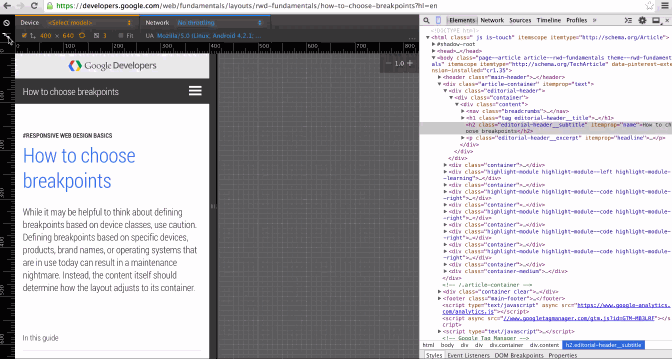
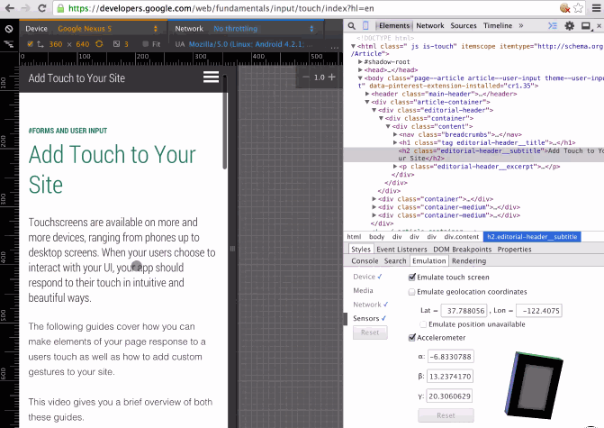

# 设备模式 & 移动仿真

随着移动用户的增长，移动端友好的响应式网站设计变得越来越重要。网页的内容要在不同的设备以及各种网络环境下看起来都不错才行。但是想要测试移动端的体验需要较长时间，并且调试也相当困难。

在你的浏览器选项卡中有设备模式，该模式可以让你看到在设备上的体验效果，这就是移动仿真的力量。

你可以使用设备模式来：

- 通过[模拟不同的屏幕大小和分辨率](#screen-emulator)来测试你的响应式设计效果如何，此模式下 Retina 屏幕也可以模拟。
- 使用[网络模拟器](#network-conditions)来评估你的站点的性能，并且不会影响到其他选项卡。
- 可视化并[审查 CSS 媒体问题](#media-queries)。
- 准确[模拟设备输入](https://developer.chrome.com/devtools/docs/device-mode#device-sensors)，比如触控事件、地理位置以及设备屏幕朝向。
- 结合目前已经学过的 DevTools 技以及设备模式，可以更好的提高你的调试工作流效率。

>注意：该文档所提及的某些功能可能并不是稳定版 Chrome 自带的。如果你无法使用 Chrome 某种新特性，请使用 [Chrome Canary](https://www.google.com/intl/en/chrome/browser/canary.html) 来获取最新版本的 DevTools。

## 启用设备模式

要打开设备模式请点击**切换设备模式 ** 图标。当设备模式开启的时候，该图标会变成蓝色并且当前视图会变成设备模拟器。

你也可以用键盘快捷键来让设备模式在启用和禁用之间切换：
<kbd>Ctrl</kbd>+ <kbd>Shift</kbd> + <kbd>M</kbd>（或者在Mac上使用 <kbd>Cmd</kbd> + <kbd>Shift</kbd> + <kbd>M</kbd>）

## 使用屏幕模拟器

设备模式下的屏幕模拟器可以让你不用在不同设备之间切换就能测试站点的响应灵敏度。

### 从使用预设的设备开始

设备模式中已经含有不少预设的设备让你能够更快地开始调试。下拉预设的设备栏来快速选择一个特定的设备。

 
从列表中选择设备可以省去手动配置的时间。

每个预设的设备通过以下方式来模拟设备：

- 将请求指定为 UA 字符串
- 设置设备的分辨率和像素比
- 开启触控仿真（如果能够使用的话）
- 模拟设备的滚动条并加入到视图中，然后将视图调整到设备的视角
- 页面的自适应文本不需要专门定义设备视角

**提示**：通过**模拟屏幕分辨率 ** 复选框可以开启或者关闭屏幕分辨率模拟器。点击**更改方向**    图标可以在横向和竖向之间切换屏幕。选中 **Fit** 复选框来使模拟器的屏幕保持浏览器窗口大小，必要的时候会缩放视图来适应浏览器窗口（此设置是为了方便并且用统一的方式来模拟设备）。

### 自定义屏幕设置

如果想要对模拟器做出更加细致的设定，你可以使用预设设备列表下方的分辨率设置。

 
通过调整屏幕分辨率和像素比来自定义屏幕模拟器

想要自定义一个屏幕尺寸，可以在设备的长宽字段内设置 CSS 像素尺寸值。

如果你想在一个非 Retina 屏的设备上模拟 Retina 屏设备，调整**设备像素比 ** 字段。设备像素比（DPR）是指逻辑上的像素和实际像素之比。拥有 Retina 屏的设备，比如 iPhone 5，拥有比普通设备更加高的像素密度，这对清晰度和视觉区域的大小有一定影响。

网页中关于 DPR 密度的一些例子如下：

- CSS 媒体查询，比如  <code>@media (-webkit-min-device-pixel-ratio: 2), (min-resolution: 192dpi) { ... } </code>
- CSS [图片设置](http://dev.w3.org/csswg/css-images/#image-set-notation)规则
- 图片[来源](http://www.w3.org/html/wg/drafts/html/master/embedded-content.html#attr-img-srcset)属性如何设置
-  <code>window.devicePixelRatio</code> 属性

>提示：如果你有 Retina 屏设备，你就会注意到低 dpi 图像看起来会存在马赛克而高 dpi 看起来则相当清晰。想要在普通屏幕中模拟这种效果，将 DPR 设置为 2 并且通过缩放来调整屏幕尺寸。此时 2x 的信息看起来会很清晰，而 1x 则很模糊。

## 模拟网络连接

对于移动端用户来说，在不同网络状况下站点都能有良好表现是非常重要的。

设备的网络连接状况可以让你来测试你的站点在不同网络状况下的变现如何，包括 2G、3G 甚至是离线状态都可以模拟。在预设的列表中可以选择网络连接，选好之后相应的网络带宽限制和延时操作状况就会在程序中生效。

 
<figcaption>在预设的列表中选择一种网络可以使相应网络状况生效</figcaption>

网络限制会自动限制其最大下载吞吐量（传输速率）。延时操作会在连接时自行产生最低的延迟（RTT）。

## 审查 media query

[Media query](https://developers.google.com/web/fundamentals/layouts/rwd-fundamentals/use-media-queries) 是响应式网站设计中相当重要的一部分。设备模式让你能够更轻松地审查 media query。

要使用 media query，点击窗口左边顶部的 **media query ** 图标。DevTools 会检测到你的样式表中的 media query 并将他们用不同颜色的长条在顶部显示。

 
<figcaption>media query 监视器</figcaption>

media query 的颜色表示：

- 蓝色：查询目标的最大宽度。
- 绿色：查询目标宽度范围。
- 橘色：查询目标最小宽度。

### 预览屏幕样式

点击 media query 条形图案来调整模拟器的分辨率并预言目标屏幕大小的样式。

### 查看 CSS

右键点击某个长条可以查看 media query 是在 CSS 中哪里定义的，并且可以跳转到源码中的相应位置。

 
<figcaption>使用 media query 监视器来预览样式并锁定源码中的位置</figcaption>

**提示**：你使用 media query 监视器的时候，你可能觉得你并不想一直开启移动模拟器。要在不退设备模式的情况下关闭移动模拟器，点击 **全部重置 ** 图标并刷新页面即可。

### 预览更多媒体类型的样式

Media query 监视器的目标样式主要用于屏幕。如果你想预览其他媒体类型，比如输出，你可以在模拟选项下的 media 面板中实现这一功能。

通过点击浏览器窗口顶部右侧的 **More overrides ** 图标来打开 DevTools 模拟菜单。

  
<figcaption>media 面板</figcaption>

选中 **CSS media** 复选框，然后在下拉列表中选择一种媒体类型。

## 模拟设备传感器

由于大多数电脑没有触控屏幕、GPS 芯片以及加速器，这些设备的输入是很难在开发设备上测试的。设备模式的传感模拟器减少了大部分模拟常规设备传感器的开销。

要控制传感器，点击浏览器右侧上方的 **More overrides ** 图标。然后在出现的模拟菜单中选择 **Sensors**。

 
<figcaption>sensors 面板</figcaption>

>注意：如果你的应用使用 JavaScript（如 Modernizr）来检测传感器状况，请确认你是在开启传感模拟器后重新加载页面。

### 触发触摸事件

触屏模拟器让你可以精准测试点击事件，并且其反应就像你用的就是一台触屏设备一样。

在 sensors 面板中选中 **Enable touch screen** 复选框来启用触控模拟。

当你和模拟界面进行交互的时候，光标会变成一个手指大小的圆圈，并且触控事件会可以像在移动设备上一样被触发。（例如 touchstart，touchmove,touchend）

>注意：要触发 <code>elem.ontouch</code> 处理，你必须使在 Chrome 上使用[命令行标签](http://www.chromium.org/developers/how-tos/run-chromium-with-flags) <code>--touch-events</code>。默认情况下触控仿真[不会触发](https://code.google.com/p/chromium/issues/detail?id=133915)这些处理器。

 

<figcaption>提示：按住 <kbd>Shift</kbd>键然后拖动鼠标可以模拟双指缩放手势</figcaption>

### 模拟多点触控

在支持多点触控输入的设备上（电脑的触控板等），你可以模拟移动设备的多点触控事件。如果想要了解关于设置多点触控模拟的更多信息，请参考 [HTML5 Rocks](http://www.html5rocks.com/en/mobile/touch/#toc-touchdev) 上“DevTools” 部分的网页多点触控开发指南。

**提示**：可以使用[这份代码](http://www.paulirish.com/demo/multi)来尝试结合 DevTools 调试器以及触控仿真。

### 重写地理定位数据

和电脑不同，移动设备一般会使用 GPS 硬件来监测位置信息。在设备模式下，你可以通过 [Geolocation API](http://www.w3.org/TR/geolocation-API/) 来模拟定位。

在 sensors 面板下选中 **Emulation geolocation coordinates** 复选框可以开启定位模拟器。

在地理定位信息无法使用的情况下，你可以使用模拟来重写 navigator.geolocation 的位置信息。

**提示**：使用[这份代码](http://html5demos.com/geo)来实际体验一下地理定位模拟器。

### 模拟设备屏幕方向

如果你需要测试加速器信息，只需要使用 [Orientation API](http://www.w3.org/TR/screen-orientation/)。同时，你也可以使用加速计模拟器来模拟相关数据。

在 sensors 面板中选中 **Accelerometer** 复选框来启用加速计模拟器。

你可以对以下方向数据做出操作：

- α: z轴的旋转数值
- β: 从左向右的倾斜值
- γ: 从前向后的倾斜值

你也可以直接点击并拖动加速计模型来将设备调整到需要的方向。

**提示**：通过[这份代码](http://www.html5rocks.com/en/tutorials/device/orientation/deviceorientationsample.html)来实际尝试加速计模拟器。

## 自定义设备

设备模式提供了大量的仿真设备。如果你发现有些设备并没有涵盖到，那么你可以添加一个自定义的设备。要添加一个自定义的设备，请执行以下步骤：

1. 前往 DevTools 设置页面。
2. 激活 Devices 选项卡。
3. 点击面板底部的 "Add custom device" 按钮。
4. 在接下来显示的表单中填入相应的数据。
5. 点击 "Add Device"。
6. 开启设备模式然后在设备列表中找到你设置的自定义设备。

 
添加新设备

## 限制

尽管 Chrome 的设备模式提供了许多实用的工具，它也有着一定的限制。

目前已知的问题有以下这些：

- 设备硬件问题
  - GPU 和 CPU 还无法模拟。
- 浏览器的 UI 问题
  - 移动系统的某些显示部分，比如地址栏，无法模拟。
  - 一些原生的显示模式，比如 \<select> 元素等，无法模拟。
  - 一些增强功能，比如通过数字输入来打开键盘等行为，可能和实际设备不大相同。
- 浏览器的功能问题
  - 在模拟器中使用了 WebGL 功能，但是在 iOS 7 的设备上并不支持该功能。
  - Chrome 不支持 MathML，但是 iOS 7 设备支持该工呢过。
  - [iOS 5 方向缩放问题](https://github.com/scottjehl/device-bugs/issues/2)并没有模拟出来。
  - CSS 的行高属性在模拟器中可以使用，但是 Opera Mini 并不支持该属性。
  - 一些 CSS 规则的限制，比如在 [Internet Exploer](http://blogs.msdn.com/b/ieinternals/archive/2011/05/14/10164546.aspx) 中的那样，并没有模拟出来。
- AppCache
  - 在模拟器中 AppCache 的 [manifest](https://code.google.com/p/chromium/issues/detail?id=334120) 文件以及[查看源请求](https://code.google.com/p/chromium/issues/detail?id=119767)并没有覆盖掉 UA。
  
尽管有着上述诸多现实，设备模式模拟器依旧足以承担大多数工作。当你想在实际设备上测试的时候，你可以参考 DevTools 的教程 [remote debugging](https://developer.chrome.com/devtools/docs/remote-debugging) 来了解更多信息。

以上内容适用于 [CC-By 3.0 license](http://creativecommons.org/licenses/by/3.0/)