# 编辑样式以及 DOM

## 简介
**元素（Elements）面板**使你可以浏览当前页面的结构化信息，在如今的应用中，为初始页面载入服务的 HTML 标记不一定是你在文档对象模型（DOM）树中看到的那样。在调试以及创建网页的时候，实时展示页面样式将会是非常有用的功能。

你可以使用元素面板来完成多种工作：

- 检查网页的 HTML 和 CSS 元素
- 测试不同的布局
- 实时编辑 CSS

如果想要更好地利用屏幕空间，请遵循下面这些有关工作区间的提示：

- **关掉**你不常用的面板。
- 调整 DOM 树和侧栏之间的**分隔线**。

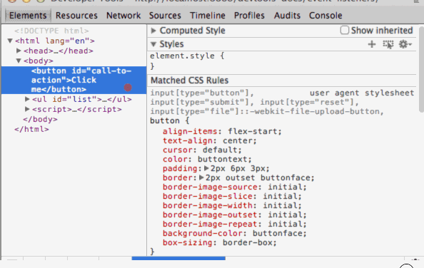

## DOM

DOM 树窗口展示了当前页面的 DOM 结构。DOM 树实际上是由 DOM 节点构成的一棵树，并且每个节点都表示一个 HTML 元素，比如body 标签和 p 标签。为了阅读的便捷性，DOM 树窗口使用 HTML 元素标签来代替 DOM 节点，例如，用p标签来代替 HTMLParagraphElement。

DOM 树视图展示了树当前的状态，这可能和最初加载的 HTML 页面并不相符，原因如下：

- 你可能使用 Javascript 修改了 DOM 树。
- 浏览器引擎可能尝试着修复无效的标签，因而产生和预期不符的 DOM 树。

### 审查元素

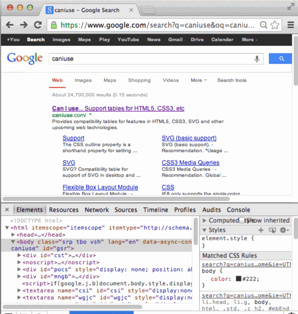

审查元素界面会展示的 负责呈现的元素显示在浏览器中的 DOM 节点和 CSS 样式表。

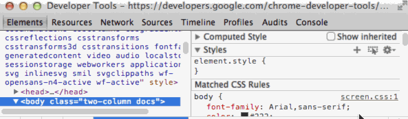

审查元素的方式有多种：

- 使用右键点击页面上的任何元素，然后选择I**nspect Element**。
- 按<kbd>Ctrl</kbd>+<kbd>Shift</kbd>+<kbd>C</kbd>（在Mac上则是<kbd>Cmd<kbd>+<kbd>Shift</kbd>+<kbd>C</kbd>）以审查元素模式打开 DevTools，然后点击一个元素。
- 点击 DevTools 窗口顶部的 `Inspect Element button`，随后会进入审查元素模式，然后选择元素。
- 在控制台中使用 `inspect()` 方法，比如`inspect(document.body)`。关于如何使用 inspect 请参考[Command-Line API](https://developer.chrome.com/devtools/docs/commandline-api)

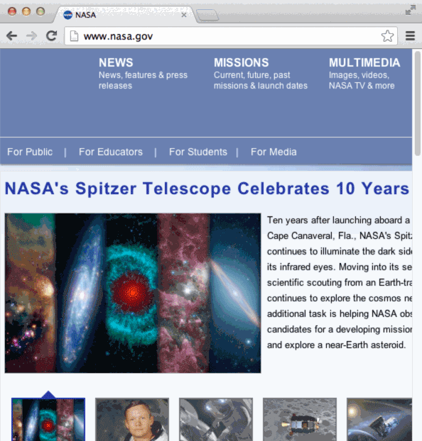

### 使用鼠标或键盘来定位 DOM 元素

你可以使用鼠标或者键盘在 DOM 结构中进行定位。

- 如果要展开一个收缩的节点，双击这个节点或者按**键盘的右键**。
- 如果要隐藏一个展开的节点，双击这个节点或者按**键盘的左键**。

展开一个节点的时候会自动选中它的第一个孩子节点，因此你可以通过多次按**右键**来展开一个深度嵌套的结构。

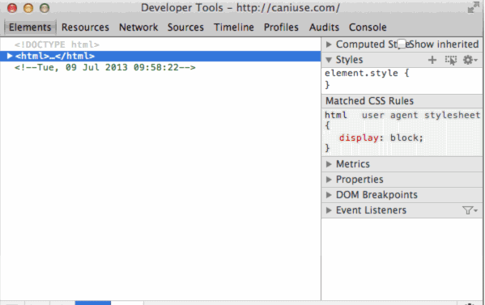

在你定位的时候，元素面板会在底部显示浏览路径：

当前选中的节点用蓝色高亮显示，在该结构上向下定位会展开尾部：

沿着结构向上定位则会移动高亮部分：

DevTools 路径尾部会显示尽可能多的条目：

如果整个路径不能在状态栏中完整显示，那么就会用省略号（...）来表示省去的路径，点击省略号就会显示隐藏的元素。

有空可以看看这份[快捷键表](https://developer.chrome.com/devtools/docs/shortcuts.html)

### 编辑 DOM 节点以及属性

元素面板允许你修改 DOM 元素：

- 像 HTML 一样编辑 DOM 节点。
- 单独增加或删除 DOM 节点。
- 编辑属性名称和值。
- 移动 DOM 元素。

更新内存中的 DOM 树并不会修改源文件，重新加载页面的时候会 DOM 树上的全部更改都会消失。

### 编辑 DOM 节点

对于 DOM 节点，双击它可以打开元素标记（H2,section,img）。现在，该字段是可以编辑并且能重命名的，重命名后关闭标签就会自动更新标签信息。

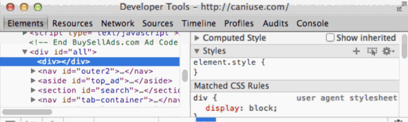

### 编辑属性

对于 DOM 属性，DevTools 会区分属性名和属性值，点击这些元素相应的部分来进入编辑状态。

- 双击属性名来编辑属性名，这个过程是和属性值无关的。
- 双击属性值来编辑这部分的类容而不影响属性名。

编辑模式处于活跃状态时，通过按 Tab 键可以在属性值之间循环。一旦到达了最后一个属性值，再按 Tab 键则会创建一个新的属性字段。

使用 Tab 不是增加并编辑属性的唯一方式，它只是一种常见的模式，实际上，在 DOM 节点的上下文菜单中，有专门的添加属性和编辑属性的条目。

- 选择 **Add Attribute** 来在打开的标签结尾添加一个新的字段。
- 选择 **Edit Attribute** 来修改一个已存在的属性。这个动作是上下文敏感的，你右键点击的部分将决定节点中哪个部分会进入可编辑状态。

### 像 HTML 一样编辑 DOM 节点

如果想像 HTML 一样来编辑 DOM 节点及其子节点：

- 右键点击相应节点并选择 **Edit as HTML**（在 Windows 下，按`F2`来使当前选中节点切换到编辑状态）

使用可编辑域来完成你的修改。

- 点击可编辑域以外的地方来完成对 DOM 节点的修改

按`Esc`键可以在不修改节点的情况下推出编辑。

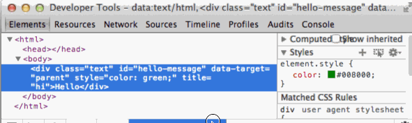

### 移动元素

你可以在元素面板中重新排列 DOM 树节点来测试页面在不同布置下的状况。

在元素面板中拖动节点来将它移动到 DOM 树中的其他位置。

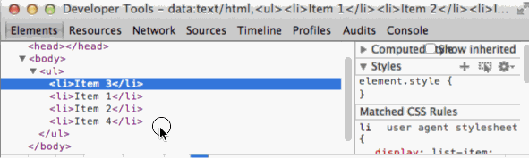

### 删除元素

使用以下技巧来删除 DOM 节点：

- 右键点击节点并选择 **Delete Node**。
- 选择节点并按`Delete`键（即删除键）。

你也可以在 **Edit as HTML** 菜单删除相应标签来删除元素。

如果你不小心删除掉了某个元素，通过`Ctrl`+`Z`组合键回溯到最近一次动作。（或者在Mac下按`Cmd`+`Z`）

### 在视图中滑动到相应位置

当你的鼠标悬停在一个 DOM 节点或者选中了一个 DOM 节点时，在浏览器主窗口中渲染的相应元素就会高亮显示。如果该元素在屏幕之外显示，浏览器窗口的边缘会有一个提示告诉你，选中的元素在屏外之外。

如果想将屏幕滑动至元素出现在屏幕上为止，右键点击该元素并选择 **Scroll into View**。

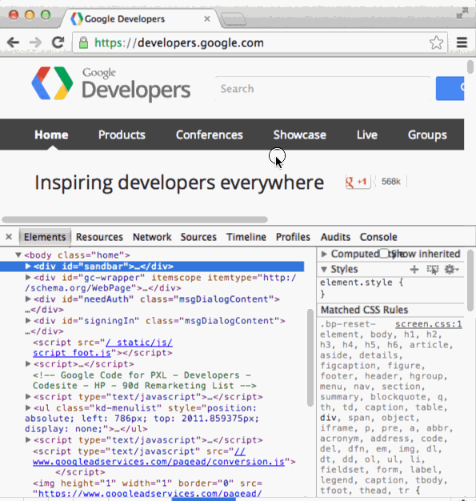

### 设置 DOM 断点

DOM 断点类似于源面板中的断点，它用来暂停在一定条件下运行的 JavaScript 代码。JavaScript 断点是和 JavaScript 文件的特定行相关联的，并且在执行到该行的时候被触发。而 DOM 断点是和特定的 DOM 元素相关联的，并且在元素被用某种方式修改时触发。

当你不确定 JavaScript 脚本的哪一部分会更新给定元素的时候，你可以使用 DOM 断点来调试复杂的 JavaScript 应用。

举个例子，如果你的 JavaScript 脚本用于更改 DOM 元素的样式，你可以设定一个在相关元素属性被修改时触发的 DOM 断点。

<strong>子树的修改</strong>

当一个子元素添加，删除或移动时，将会触发子树修改断点。例如，如果在 ‘main-content’ 元素上设置子树修改断点，下面的代码会触发断点：

~~~

var element = document.getElementById('main-content');

//修改元素的子树

var mySpan = document.createElement('span');

element.appendChild( mySpan );

~~~

<strong>属性修改</strong>

当元素的属性（class,id,name）动态发生变化时，会出现属性修改：

~~~

var element = document.getElementById('main-content');

// 元素的 class 属性被修改

element.className = 'active';

~~~

<strong>节点移除</strong>

当问题提及的节点从 DOM 中移除时，将触发节点移除修改：

~~~

document.getElementById('main-content').remove();

~~~

在上面的演示中，有下面这么几个步骤：

- 用户在搜索框中输入数据，输入框尺寸发生变化。
- 用户在搜索框上设置了一个属性修改断点。
- 用户继续在搜索框中输入数据，触发了断点，并且停止执行。
- 用户鼠标悬停在 JavaScript 变量上方，相应变量的详细信息会展示出来。

元素和源面板都包含了一个管理 DOM 断点的面板。

要查看你的 DOM 断点，点击断点旁边的扩展箭头以显示断点面板。对于每个断点，其元素标识符和断点类型都会显示出来。

你可以通过以下几种方式来和断点进行交互：

- 在元素标示符上<strong>悬停</strong>以显示元素在页面中相应的位置（和在元素面板中的节点上悬停是类似的效果）。
- 点击一个元素，可以跳转到它在元素面板中的位置。
- <strong>切换复选框</strong>来启用或者禁用断点。

当你触发 DOM 断点时，这个断点会在 DOM 断点面板中高亮显示。<strong>调用栈</strong>面板会显示调试器暂停的原因：

### 查看元素事件监听器

查看与时间监听器面板中 DOM 节点相关联的 JavaScript 事件监听器。

事件监听器器面板中的顶级项目会显示已注册监听器监听的事件类型。

单击事件类型旁边的展开箭头以查看已注册的事件处理器列表，每个处理器其都是由 CSS 选择器所标记的，就像元素标示符  "document" 或者 "button#call-toaction" 等。如果多个处理器为相同的元素而注册，则该元素会被重复列出。

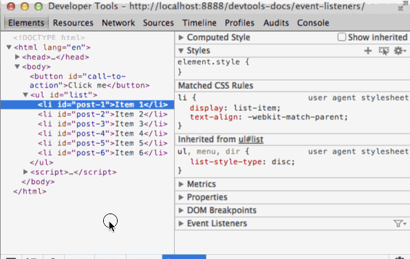

点击元素标识符旁边的展开箭头以查看事件处理器的属性，事件监听器为每个监听器列出了以下属性：

- **handler**：包含回调方法。右键点击方法并选择 <strong>Show Function Definition</strong> 来查看该方法定义的地方。（如果源代码可用的话）
- **isAttribute**：如果事件是通过 DOM 属性注册则返回 True。（例如， onclick）
- **lineNumber**：包含事件注册的行号。
- **listenerBody**：代表回调函数的字符串。
- **node**：监听器注册的那个 DOM 节点。鼠标悬停在此可以显示它在页面视图中的位置。
- **sourceName**：包含事件监听器的源文件的 URL 路径。
- **type**：事件所注册的类型。（例如， click）
- **useCapture**：一个布尔值，表示是否已设置 addEventListener 中的 [useCapture](https://developer.mozilla.org/en-US/docs/Web/API/EventTarget.addEventListener) 标志。

默认状态下，已注册的事件处理器会显示以下类型的元素：

- 当前选中的元素。
- 当前选中元素的祖先节点。

如果你觉得包括了那些使用事件委托注册的处理器之后，视图上显示的事件处理器太多了，可以点击 **Filter** 然后在菜单列表中选中 **Selected Node Only** 就可以只显示那些在相应节点上注册的事件监听器。

>注意：很多 chrome 的扩展插件会把它们的事件监听器也添加到 DOM 中。

如果你发现了一些不是由你的代码所设置的事件监听器，你可能希望在隐身模式中重新打开你的页面，在隐身模式下，浏览器默认阻止扩展插件的运行。

### 样式

CSS 定义了你的页面的表示层。你可以查看或者修改那些作用在当前页面元素上的 CSS 的声明，级联（在级联样式表中）和继承可以理解为是为了开发和调试工作流的：

- 级联涉及到为 CSS 声明给定权重，以决定在不同的规则存在重合的情况下哪一条优先执行。
- 继承涉及到如何让 HTML 元素从 CSS 所包含的元素中继承相关属性（祖先）。

如果想了解更多，请参照 W3C 关于级联和继承的文档：
[http://www.w3.org/TR/CSS2/cascade.html](http://www.w3.org/TR/CSS2/cascade.html)

### 样式面板

样式面板按照优先级从高到底的顺序显示了对应选定元素的 CSS 规则：

- 直接用于元素 style 属性的元素样式（或者在 DevTools 中使用的）。
- 匹配的 CSS 规则包括任何与元素相匹配的任何规则。例如，CSS 的选择器span 对应 HTML\ 元素。
- 继承的样式包括yu选中元素的祖先节点相匹配的任何可继承的样式规则。

上图中用数字标记的在下面有相应的解释。

1. 匹配元素的选择器相关联的样式。
2. **级联**规则指出，如果两个规则的起始、权重和特性都相同，最靠近元素定义的规则优先执行。在这种情况下，第二个元素属性将取得优先权，第一个元素属性会以被画了删除线的形式来显示在文本中，表明它被复写了。
3. **User agent stylesheets** 是被明确标记的，而且通常会被你的网页上的 CSS 覆盖。
4. 这里的级联表明，作者的样式的优先权是高于使用者的代理样式的，所以样式 display:inline-block 覆盖了用户定义的样式 display:block。
5. **继承**的样式会在 “Inherited from [node]”这一栏下面显示。点击该栏中的 DOM 节点就可以定位到它在 DOM 树中的位置。（CSS 2.1 的属性表中表明了那些属性是可以继承的）
6. 选择器 :root body 比单纯的 body 具有更高的特异性，所以它的样式声明优先。
7. body 中的 font-family 被重写了。font-size 也是类似的情况（由于选择器特异性而被重写）。

用逗号分隔的选择器颜色是不同的，具体取决于他们是否匹配所选中的 DOM 节点。

灰色的选择器，比如 audio 和 video 没有应用于有选定的节点。上述的规则和下面的 CSS 源代码相对应：

~~~

video, audio, div, .message, body *, time {
  /* visibility: hidden */
  margin-top: 10px;
}

~~~

如果可见的声明被注释掉了，那么在样式面板中它将显示为已禁用状态。

使用快捷键 `Ctrl` + 点击（或者在Mac上用 `Cmd` + 点击） 样式面板中的 CSS 属性或者属性值，可以定位到他们在源码中的位置，并切换到源代码面板。

#### 编辑及创建样式

你可以在元素面板中的样式面板上添加或者修改样式。除了包含样式信息的区域显示为灰色外（就像是 user agent stylesheets 那种情况），所有的样式都是可编辑的。可以通过以下方式来编辑样式：

- 编辑已有的属性名称或者属性值。
- 添加新的属性声明。
- 添加新的 CSS 规则。

想要启用或者禁用某个样式的声明，勾选或者取消它旁边的复选框。

#### 编辑已有的属性名或者属性值

点击 CSS 属性的名称来编辑其名称：

点击属性值可以修改其值。如果你正在修改属性名称，按 Tab 或者 Enter 键可以开始编辑属性值。

默认情况下，你对 CSS 做出的更改都是暂时的，重新加载页面的时候所有修改都会复原。想要自定义相关行为，可以参考 [WorkSpace](
https://developer.chrome.com/devtools/docs/workspaces.html)

当编辑一个属性值为数字的 CSS 时，你可以使用以下的快捷键来增加或者减少 CSS 属性的数值：

- 按 `Up` 或者 `Down` 来将相应值增加或者减少1.（如果当前值在-1到1之间，则每次变动0.1）
- 按 `Alt` + `up` 或者 `Alt` + `Down` 来让相应值增加或者减少0.1。
- 按 `Shift` + `Up/Down` 或者 `PageUp`/`PageDown` 来让相应值增加或者减少10。
- 按 `Shift` + `PageUp`/`PageDown` 来让相应值增加或者减少100。

#### 使用颜色选择器

你可以通过使用颜色选择器来把某个颜色修改或者设置
为当前页面样式面板中已经存在的颜色。

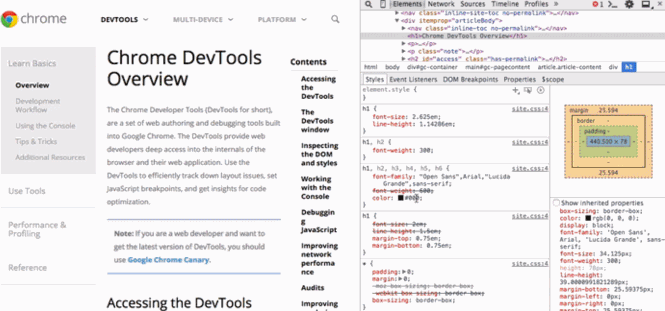

#### 添加新的属性声明

点击符合可编辑 CSS 规则的空白区域就可以创建一个新的样式，此时编辑模式适用于当前 CSS 属性字段，你可以出输入一个新的属性。

要添加新的属性并且在 CSS 属性字段中查看代码提示，请执行以下步骤：

- 在 CSS 属性字段中输入内容，下拉框中会显示建议。
- 按 `Up` 或者 `Down` 来选中某一条建议。
- 要接受建议使用 `Tab` 键，右键或者 `Enter` 键。

当你选择了一个有效的 CSS 属性后，将光标移动到 CSS 属性值字段以获取可关于使用的 CSS 值的建议。例如，对于属性 **display**，建议的值有 **block**，**flex**，**none** 等等。

使用 `Ctrl` + `V`（或者在Mac上使用 `Cmd`+ `V`）来把 CSS 粘贴到样式面板中。属性和其值会被解析并放到正确的字段中。

### 添加样式规则

你可能会觉得在一个**新的选择器**中添加样式比较好。在样式面板的头栏中点击加号来创建新的 CSS 规则。

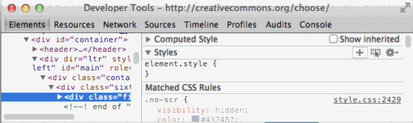

### 在元素上触发伪类

你可以使用伪类选择器为你的 UI 元素提供动态的样式，比如：hover。然而，这些动态的元素很难调试。所以 DevTools 允许你手动为各个元素设置伪类。

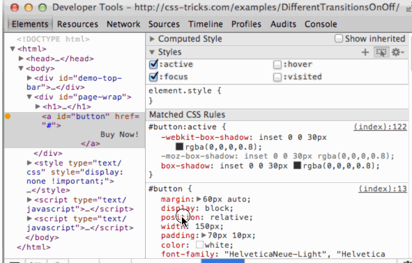

你可以触发下面四个伪类的任意组合：

- **:active** - 适用于激活过程中的链接（例如，单机前）。
- **:hover** - 适用于当鼠标悬停在元素上方时。
- **:focus** - 适用于获得焦点的元素（比如，通过 Tab 键来获取焦点）。
- **:visited** - 适用于浏览器中已经浏览过的链接。

如果要设置元素的状态的话：

- 点击样式面板中 **New Style Rule** 旁边的 **Toggle Element State** 按钮。
- 右键点击元素面板中的一个 DOM 节点然后选中 **Force Element State**。

#### 更改历史记录（本地修改）

本地修改包含了对源文件代码，如 JavaScript 和 CSS 所做的修改。

用以下方式来找到本地修改面板：

- 打开**源面板**。
- 右键（或者在 Mac 上使用 `Ctrl` + 鼠标点击）点击侧栏中的某个源文件。
- 选择 **Local modifications**。

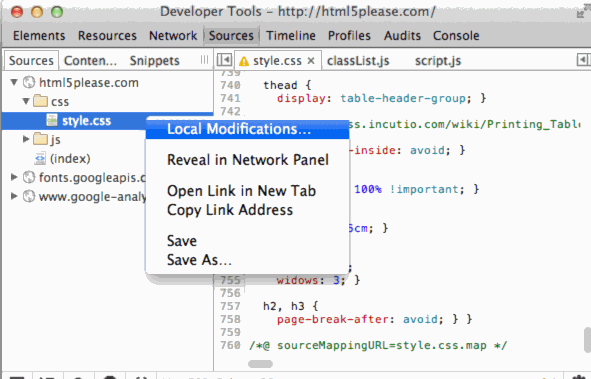

要做出修改，在 Source 面板的编辑器里修改源代码即可。

要对一个源自于外部样式表的 CSS 规则做出修改，请注意本地修改面板中的变化。

>注意：当你使用 **New Style Rule** 按钮的时候，新的 CSS 规则并不属于已经存在的样式表中。DevTools 把它添加到一个特殊的监视样式表中，这个监视样式表可以像其他文件一样在源面板中被修改。

关于本地修改面板：

- 展开顶层文件名，可以查看修改发生的时间
- 展开第二级的项目来查看对应修改的[不同之处](https://en.wikipedia.org/wiki/Diff_utility)（之前及之后的）。粉色背景的一行表示删除的部分，绿色背景的一行表示添加的部分。
- 点击文件名排旁边的 **revert** 来撤销掉在该文件上的全部修改。

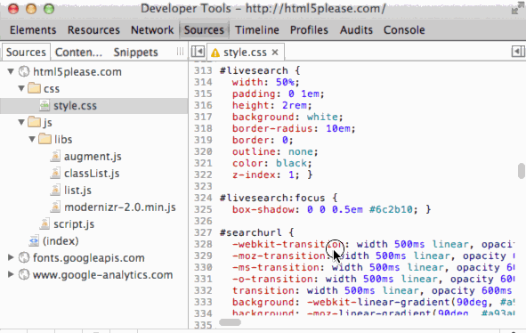

你也可以使用 `Ctrl` + `Z`（或者在Mac上使用 `Ctrl` + `Z`）来迅速撤销在元素面板上对 DOM 或者样式的细小改动。

## Metrics 面板

Metrics 面板直观阐述了样式是如何影响 CSS 盒子模型的。

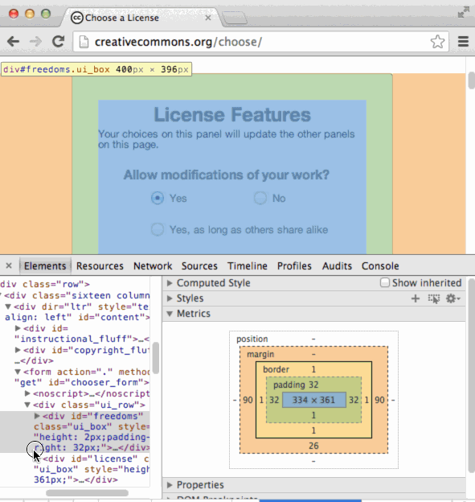

Metrics 面板显示了一组表示盒子维度的矩形，以此来表示 CSS 盒子模型。内部的内容框显示内容区域的尺寸，外部的边框，比如边界的边框，表示每个边缘的值：border-top（上边框），border-right（右边框），border-bottom（下边框），and border-left（左边框）。

如果边缘没有设定值，将会用破折号（英文的）来代替。

>注意：如果你提供了一个非静态的值给 CSS 位置属性，那么 Metrics 面板中会显示标记的位置。

**Boxes** （盒子）显示的内容可能是（自外向内）：

- position （位置）
- margin （边距）
- border （边界）
- padding （内边距）
- Content box （内容盒子，最内层，没有标记）

通过以下技巧来使用 metrics 面板：

- 鼠标悬停在盒子上方来使浏览器窗口中相应的区域高亮显示。
- 编辑盒子内的字段（如果没有值则用破折号显示），该更改会在 element.style 部分中反映出来。

以上内容在[CC-By 3.0 license](http://creativecommons.org/licenses/by/3.0/)下可用。