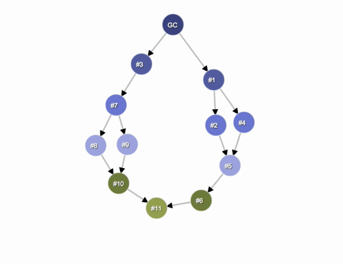
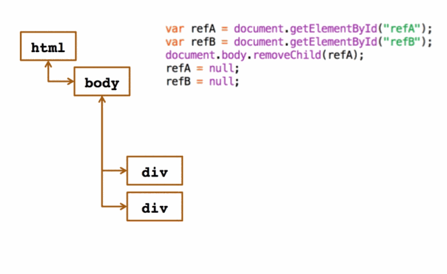

# JavaScript 内存分析

**内存泄露**是指计算机内存逐渐丢失。当某个程序总是无法释放内存时，就会出现内存泄露。JavaScript web 应用程序可能会经常遇到类似于本地程序中内存泄露这样的问题，比如泄露和膨胀，但是 JavaScript 有**内存回收机制**可以解决此类问题。

尽管 JavaScript 使用了内存回收机来自动管理内存，[高效](http://www.html5rocks.com/en/tutorials/memory/effectivemanagement/)的内存管理策略依然是相当重要的。在本章中我们会详细说明 JavaScript web 应用程序中的内存问题。在学习某些特性的时候请尝试这些[示例](https://developer.chrome.com/devtools/docs/javascript-memory-profiling#supporting-demos)，这可以增进你对于工具运行原理的认识。

在开始之前，请查看 [Memory 101](https://developer.chrome.com/devtools/docs/memory-analysis-101.html) 页面来熟悉一下相关的专业术语。

>**注意**:我们在后面使用的有些特性是只有 [Chrome Canary](http://www.google.com/intl/en/chrome/browser/canary.html) 才支持的。我们建议使用此版本的工具，这样您就可以对您的应用程序做出最佳的内存分析。

## 应该问自己的一些问题

通常情况下，当你认为你的程序出现内存泄露的时候，你需要问自己三个问题：

- **是不是我的页面占用了太多的内存？**- [内存时间轴视图](https://developer.chrome.com/devtools/docs/javascript-memory-profiling#memory_mode) 以及 [Chrome 任务管理器](https://developer.chrome.com/devtools/docs/javascript-memory-profiling#chrome_task_manager) 可以帮助你来确认是否占用了过多的内存。内存视图在监察过程中可以实时跟踪 DOM 节点数目、文件以及 JS 事件监听器。有一条重要法则需要记住：避免保留对已经不需要的 DOM 元素的引用，不必要的事件监听器请解除绑定，对于大量的数据，在存储时请注意不要存储用不到的数据。
- **我的页面是不是没有内存泄露的问题？**- [对象分配跟踪器](https://developer.chrome.com/devtools/docs/javascript-memory-profiling#object_allocation_tracker)能够让你看到 JS 对象的实时分配过程，以此来降低内存泄露的可能。你也可以使用[堆探查器](https://developer.chrome.com/devtools/docs/javascript-memory-profiling#heap_profiler)来记录 JS 堆的状态，然后分析内存图并将其与堆状态进行比对，就可以迅速发现那些没有被垃圾回收器清理的对象。
- **我的页面应该多久强制进行一次垃圾回收？** - 如果垃圾回收器总是处于垃圾回收状态，那么可能是你对象分配过于频繁了。[内存时间轴视图](https://developer.chrome.com/devtools/docs/javascript-memory-profiling#identifying_a_memory_problem_with_the_devtools_timeline)可以在你感兴趣的地方停顿，方便你查看回收情况。

**视图内容**

## 术语以及基本原理

这个部分介绍了**内存分析**中常见的术语，即使是在其他语言的内存分析工具中，这些术语也同样有用。这里所说的术语和概念是用于堆探查器界面以及相应文档中的。

了解这些术语后，你们就能更加高效地使用这个工具。如果你曾经使用 Java、.Net 或者其它内存分析器，那么该篇的内容对你而言就是一次提升。

### 对象的大小

请将内存状况想象为一副图片，图中有着一些基本类型（像是数字以及字符串等）和对象（关联数组）。如果像下面这样将图中的内容用一些相互连接的点来表示，可能有助于你对此的理解：

对象可以通过两种方式来获取内存：

- 直接通过它本身。
- 通过包含对其它对象的引用，这样就会阻止垃圾回收器（简称 GC）自动回收这些对象。

当使用 DevTools 中的堆分析器（一种用于查找“配置文件”下的内存问题的工具）的时候，你会发现你所看到的是几列信息。其中最重要的就是 **Shallow Size** 以及 **Retained Size**，不过，这两列究竟意味着什么呢？

### Shallow size

这是指对象本身获得的内存大小。

典型的 JavaScript 对象会获得一些保留的内存，用于他们的描述以及存储即时产生的值。通常情况下，只有数组和字符串才会有比较明显的浅层大小。不过，字符串和外部数组往往在渲染内存中有它们自己的主存储器，对 JavaScript 堆只露出一点包装后的对象。

渲染内存是指所监视的页面被渲染的过程中使用的内存：原本分配的内存 + 该页面在 JS 堆中的内存 + 所有因为该页面而导致的 JS 堆中其他对象的内存开销。然而，即使是一个小的对象也可以通过阻止垃圾回收器自动回收其他对象来间接保有大量的内存。

### Retained size

这是指对象以及其相关的对象一起被删除后所释放的内存大小，并且 **GC roots** 无法到达该处。

**GC roots** 是由在从原生代码的 V8 之外引用 JavaScript 对象的时候所创建的句柄（局部或者全局的）构成的。这些句柄可以再堆的快照中 **GC roots > Handle scope** 以及 **GC roots > Global handles** 中找到。在没有谈及浏览器实现的细节的情况下，就在本文中说明句柄会令读者感到困惑，故而关于句柄的细节本文不做讲解。事实上，无论 GC roots 还是句柄，都不是你需要担心的东西。

内部的 GC roots 有很多，不过用户对其中的大部分都不感兴趣。从应用程序的角度来说，有下面这么几种 roots：

- 窗口全局对象（在每一帧中）。在堆快照中，有一个距离域，其包含的是在窗口最短保留路径上的属性引用的数目。
- 文档 DOM 树是由所有分析该文档时能够到达的 DOM 节点构成的。并不是所有的节点都会有 JS 封装，但是如果他们有封装，那么只要文档还在，这些节点就可以使用。
- 有些时候，对象会被调试器上下文以及 DevTools 控制台保留。（例如，在控制台进行评估后）

>**注意**：我们推荐读者在清空控制台并且调试器中没有活跃的断点的情况下来做堆的快照。

下面的内存就是由一个根节点开始的，这个根节点可能是浏览器的  **window** 对象或者是 Node.js 模块的 **Global** 对象。你并不需要知道这个对象是如何被回收的。

任何无法被根节点取得的元素够将被回收。

>**提示**：Shallow 和 Retained size 都用字节来表示数据。

### 对象的保留树

就像我们前面所说的，堆就是由相互连接的对象构成的网络。在数学的世界中，这种结构称作*图*或者*内存图*。一个图是由节点和边构成的，而节点又是由边连接起来的，其中节点和边都有相应的标签。

- **节点**（或者对象）是用创建对象的构造函数标记的。
- **边**是用属性名来标记的。

在本文后面的内容中，你将会学到如何使用堆探查器来记录资料。在堆分析器记录中我们可以看到包括 Distance 在内的几栏：Distance 指的是从根节点到当前节点的距离。有一种情况是值得探究的，那就是几乎所有同类的对象都有着相同的距离，但是有一小部分对象的 Distance 的值要比其他对象大一些。

### 主导者

主导者对象是由树形结构组成的，因为每个对象都只有一个主导者。一个对象的支配者不一定直接引用它所主导的对象，也就是说，支配树并不是图的生成树。

在上面的图中：

- 节点 1 主导了节点 2.
- 节点 2 主导了节点 3，4，6
- 节点 3 主导了节点 5
- 节点 5 主导了节点 8
- 节点 6 主导了节点 7

在下面的例子中，节点 **#3** 是 **#10** 的主导者，但是 **#7** 节点也在由 GC 到 **#10** 节点的，每条简单路径上。因此，如果对象 B 存在于从根节点到对象 A 的，每条简单路径上，那么对象 B 就是对象 A 的主导者。

### V8 的细节

在本节中，我们所讲的是对应 **V8 JavaScript 虚拟机**(V8 VM 或者 VM)的内存方面的话题。这些内容对于理解堆快照为何是上面所看到的那个样子很有帮助。

#### JavaScript 对象的表示

JavaScript 中有三种主要类型：

- 数字（比如，3.14159..）
- 布尔值（true 或者 false）
- 字符串 （比如 "Werner Heisenberg"）

这些类型在树中都是叶子节点或者终结节点，并且它们不能引用其它值。

**数字**类型可以像下面这样存储：

- 相邻的 31 位整数值，被称为 **small integers** (SMIs)
- 被称为**堆数字**的堆对象。堆数字用于存储不适合 SMI 形式的值，比如*浮点*类型，或者是需要封装的值，比如设置其属性值的类型。

**字符串**可以被存储在：

- **虚拟机的堆**中
- 外部的**渲染内存**。也就是当创建或者使用一个封装后的对象时需要使用的外部存储器，比如，脚本资源以及其他从网上接收而不是赋值到虚拟机堆中存储的内容。

新的 JavaScript 对象的内存是由特定的 JavaScript 堆（或者说 VM 堆）分配的。这些对象由 V8 垃圾回收器管理，并且只要存在一个对他们的强引用就不会被回收。

**本地对象**指的是不在 JavaScript 堆中存储的一切对象。本地对象和堆对象相反，其生存周期不由 V8 垃圾回收器管理，并且只能通过封装它们的 JavaScript 对象来使用。

**Cons string** 是一个保存了成对字符串的对象，并且该对象会将字符串拼接起来，最后的结果是串联后的字符串。拼接后的 cons string 的内容只有在需要的时候才会出现。一个比较好的例子就是，如果想获取某个字符串的子串，就必须利用函数进行构建。

举个例子，如果你将 **a** 和 **b** 对象串联，那么你将获得一个字符串(a,b) 用于表示拼接后的结果。如果你之后又加入了一个对象 **d**，那么你将活的另一个字符串((a,b),d)。

**数组** - 一个数组就是有着数字键的对象。他们广泛应用在 V8 VM 中，用于存储大量数据。在字典这样的数据结构中键值对的集合就是利用数组来备份的。

一个典型的用于存储的 JavaScript 对象可以是下列两种数组类型之一：

- 命名的属性
- 数字元素

如果想要存储的是少量的属性，那么它们可以直接在 JavaScript 对象中存储。

**Map** - 一个对象，用于描述对象及其布局的种类。举个例子，maps 用于描述[快速属性访问](https://developers.google.com/v8/design.html#prop_access)的隐式对象结构。

#### 对象组

每个本地的对象组都是由保持彼此相互引用的对象组成的。以一个 DOM 子树为例，在该树中，每一个节点都一个指向父节点的连接，以及指向孩子节点和兄弟节点的链接，由此，所有的节点连成了一张图。需要注意的是，本地对象并不会在 JavaScript 堆中出席那，所以它们的大小是 0。相应的，对于每个要使用本地对象都会创建一个对应的封装对象。

每个封装对象都含有一个对相应的本地对象的引用，这是为了能够将命令重定向到本地对象上。而对象组则含有这些封装的对象，但是，这并不会造成一个无法回收的死循环，因为垃圾回收器会自动释放不在引用的封装对象。但是一旦忘记了释放某个封装对象就可能造成整个组以及相关封装对象都无法被释放。

## 先决条件以及一些有用的提示

### Chrome 任务管理器

>**注意**：在 Chrome 中分析内存问题时，一个比较好的方法就是配置 [clean-room testing 环境](https://developer.chrome.com/devtools/docs/clean-testing-environment.html)。

如果某个页面消耗了大量内存，可以在执行有可能占用大量内存的活动时使用 Chrome 任务管理器的内存这一栏来监视页面所占用的内存。如果要使用任务管理器，点击 menu > Tools 或者使用快捷键 `Shift` + `Esc`。

打开之后，右键点击列头部分然后启用 JavaScript memory 列。

### 使用 DevTools 时间轴来找出内存问题

要解决问题的第一步就是要先拥有找出问题的能力。这意味着能够创建一个用于基本问题测量的可重复性测试。如果没有一个可复用的程序，你就没办法有效地衡量问题。另外，如果连测试基线都没有的话，就没办法知道做出的改变是否提高了程序的性能。

**时间轴面板**对于发现问题出现的时间非常有帮助。页面或者应用程序加载或者进行交互时，它会给出整个流程的时间消耗的完整概述。所有的事件，从加载资源到解析 JavaScript、计算样式、垃圾回收以及重绘都会出现在时间轴上。

在寻找内存问题的时候，时间轴面板的 **Memory view** 可以用来追溯：

- 总共分配的内存 - 内存的使用量是否增长了？
- DOM 节点的数量。
- 文档的数量
- 分配的事件监听器的数量。

想要了解在内存分析时找出可能造成内存泄露的问题的更多信息，请查看 Zack Grossbart 写的 [Memory profiling with the Chrome DevTools](http://coding.smashingmagazine.com/2012/06/12/javascript-profiling-chrome-developer-tools/)

### 验证存在的问题

首先要做的事情就是找出你认为可能造成内存泄露的活动。这种活动可能是任何事情，就像是在站点上进行定位、鼠标的悬停事件、点击事件或者是与页面交互时可能对性能产生消极影响的事件。

在时间轴面板中，开始记录(`Ctrl` + `E` 或者 `Cmd` + `E`)然后执行你想测试的活动序列。要强制进行垃圾回收，点击底部的垃圾图标（）。

在下图中我们可以发现有些节点没有被回收，而这些节点所对应的图案就是内存泄露的图案样式：

如果在几次迭代后你看见了一个[锯齿](http://en.wikipedia.org/wiki/Sawtooth_wave)形的图案（在内存面板的顶部），这就说明你分配了大量短生存期的对象。但是，如果这个操作序列并没有使内存保留下来，或者 DOM 节点的数量并没有下降到刚开始执行时的那个基线上，那么你有很好的理由来怀疑这里发生了内存泄露。

一旦你确认了存在问题，你就可以借助 **Profiles panel** 中的 **heap profiler** 找出问题的来源。

>**示例**：你可以尝试一下[这个例子](https://developer.chrome.com/devtools/docs/demos/memory/example1.html)来锻炼一下如何高效使用时间轴内存模式。

### 垃圾回收

垃圾回收器（就像是 V8）能够定位到你的程序处于生存期的对象以及已经死亡的对象，甚至是无法访问到的对象。

如果**垃圾回收器**（GC）由于某些逻辑错误没能回收你的 javaScript 中已死亡的对象，那么它们所消耗的内存将无法被再次使用。像这样的情况最终会随着时间推移而使得你的应用程序的执行速率不断变慢。

如果你在编写代码时，即使是不再需要的变量以及事件监听器依旧被其他代码所引用，最终就会出现这种情况。当这些引用存在的时候，垃圾回收器就没办法正确清理这些对象。

在你的应用程序的生存期间会有一些 DOM 元素更新/死亡，别忘了检出并消除引用了这些元素的变量。检查可能引用了其他对象（或者其他 DOM 元素）的对象的属性，并留意可能随着时间的推移不断增长的变量缓存。

## 堆分析器

### 生成快照

在配置面板中，选择 **Take Heap Snapshot**，然后点击 **Start** 或者使用 `Cmd` + `E` 或 `Ctrl` + `E` 快捷键。

最初快照是存在渲染内存中的，当你点击快照图标来查看它的时候，它将会被传输到 DevTools 中。当快照载入到 DevTools 中并被解析后，快照标题下面会出现一个数字，该数字表示所有可[访问](https://developer.chrome.com/devtools/docs/memory-analysis-101.html#retaining-paths)的 JavaScript 对象的总大小：

>**示例**：尝试使用[这个例子](https://developer.chrome.com/devtools/docs/demos/memory/example2.html)来监测时间轴汇总内存的使用情况。

### 清除快照

点击清除全部配置图标()可以清楚快照（DevTools 中和渲染内存中都会删除掉）：

>**注意**：直接关闭 DevTools 窗口并不会删除渲染内存中的配置文件。当重新打开 DevTools 窗口的时候，所有之前生成的快照都会在快照列表中出现。

记得之前文章中提到过，你可以从 DevTools 中强制进行垃圾回收，并且这可以成为你的快照工作流中的一部分。当生成一个堆快照的时候，DevTools 会自动进行垃圾回收。在时间轴中该过程可以通过点击垃圾桶按钮()轻松实现。

>**示例**：尝试[这个例子](https://developer.chrome.com/devtools/docs/demos/memory/example3.html)并使用堆分析器来进行分析。你应该看到（对象）项目分配次数。

### 在快照视图间切换

一份快照可以用不同的视角来查看，这样可以更好地适应不同的需求。要在视图间切换，使用视图底部的选择器：

一共有三种默认视图：

- **总结** - 通过构造器的名称来分组显示对象
- **比较** - 显示两份快照间的不同之处
- **包含** - 允许查看堆中的内容

在设置面板中可以启用主导视图 - 显示了[主导树](https://developer.chrome.com/devtools/docs/memory-analysis-101.html#dominators)的内容，并且可以用于找到聚集点。

### 查看代码颜色

对象的属性以及属性值属于不同类型并且有着相应的颜色。每个属性都会有四种类型之一：

- **a:property** - 有名称的常规属性，通过 .（点）操作符或者 []（方括号）符号来访问，例如 ["foo bar"]；
- **0:element** - 有数字下标的常规属性，使用 []（方括号）来访问。
- **a:context var** - 函数上下文中的某个变量，在相应的函数闭包中使用其名字就可以访问。
- **a:system prop** - 由 JavaScript 虚拟机添加的属性，在 JavaScript 代码中无法访问。

被命名为 System 这样的对象是没有相应的 JavaScript 类型的。他们是 JavaScript 虚拟机的对象系统的一部分。V8 将大多数内部对象分配到和用户 JS 对象相同的堆中，所以这些都只是 V8 内部内容。

### 找到特定对象

要在堆中找到某个对象，你可以使用 `Ctrl` + `F` 来打开搜索框，然后输入[对象的 ID](https://developer.chrome.com/devtools/docs/javascript-memory-profiling#memory-profiling-faq)。

## 视图的详细内容

### 总结视图

最开始的时候，快照是在总结视图中打开的，显示了对象的整体情况，并且该视图可以展开以显示实例信息：

顶级入口是 "total" 行，他们展示了：

- **构造器**，表示所有用这个构造器创建的对象。
- **对象实例的数量**显示在 # 这一列下。
- **Shallow size** 这一列显示了当前构造器创建的所有对象的 [shallow size](https://developer.chrome.com/devtools/docs/memory-analysis-101.html#object-sizes) 总和。
- **Retained size** 这一列显示相同的对象集所对应的最大 retained size。
- **Distance** 显示了从根节点开始，从节点的最短路径到达当前节点的距离。

想上图那样展开 total line 之后，其所有的实例都会显示出来。对于每个实例，它的 shallow size 和 retained size 都会在相应列中展示出来。在 @ 字符后面的数字就是对象的 ID，该 ID 允许你在每个对象的基础上比较堆的快照。

>**示例**：通过[这个页面](https://developer.chrome.com/devtools/docs/heap-profiling-summary.html)来了解如何使用总结视图。

请记住，黄色的对象表示有 JavaScript 对象引用了它们，而红色的对象是指从一个黄色背景节点引用的分离节点。

### 比较视图

这个视图用于比较不同的快照，这样，你就可以通过比较它们的不同之处来找出出现内存泄露的对象。想要弄清楚一个特定的程序是否造成了泄露（比如，通常是相对的两个操作，就像是打开文档，然后关闭它，是不会留下内存垃圾的），你可以尝试下列步骤：

- 在执行操作前先生成一份快照。
- 执行操作（该操作涉及到你认为出现内存泄露的页面）。
- 执行一个相对的操作（做出相反的交互行为，并重复多次）。
- 生成第二份快照然后将视图切换到比较视图，将它与第一份快照对比。

在比较视图中，两份快照间的不同之处会展示出来。当展开一个总入口时，添加以及删除的对象实例会显示出来：

>**示例**：尝试[这个例子](https://developer.chrome.com/devtools/docs/heap-profiling-comparison.html)（在选项卡中打开）来了解如何使用比较视图来监测内存泄露。

### 包含视图

包含视图本质上就像是你的应用程序对象结构的俯视图。它使你能够查看到函数闭包内部，甚至是观察到那些组成 JavaScript 对象的虚拟机内部对象，借助该视图，你可以了解到你的应用底层占用了多少内存。

这个视图提供了多个接入点：

- **DOMWindow objects** - 这些是被认作“全局”对象的对象。
- **GC roots** - 虚拟机垃圾回收器实际实用的垃圾回收根节点。
- **Native objects** - 指的是“推送”到 JavaScript 虚拟机内以实现自动化的浏览器对象，比如，DOM 节点，CSS 规则（详细内容请见下一节）

下面是常见的包含视图的例子：

>**示例**：通过[这个页面](https://developer.chrome.com/devtools/docs/heap-profiling-containment.html)（在新的选项卡中打开）来尝试如何在该视图中找到闭包和事件处理器。

#### 关于闭包的小提示

为函数命名有助于你在快照中分辨不同的闭包。举个例子，下面这个函数没有命名：

~~~

function createLargeClosure() {  
    var largeStr = new Array(1000000).join('x');
    var lC = function() { 
        // this is NOT a named function
        return largeStr;  
    };  
    return lC;
}

~~~

而下面这个是命名后的函数：

~~~

function createLargeClosure() 
{  
    var largeStr = new Array(1000000).join('x');
    var lC = function lC() { 
        // this IS a named function    
        return largeStr;  
    };  return lC;
}

~~~

>**示例**：尝试一下[这个例子](https://developer.chrome.com/devtools/docs/demos/memory/example7.html)来分析闭包对内存的影响。你可能会对下面这个例子感兴趣，它可以让你深入了解[堆内存分配](https://developer.chrome.com/devtools/docs/demos/memory/example8.html)

### 发现 DOM 内存泄露

该工具的一大特点就是它能够显示浏览器本地对象（DOM 结点，CSS 规则）以及 JavaScript 对象间的双向依赖关系。这有助于发现因为忘记分离 DOM 子树而导致的不可见的泄露。

DOM 泄露肯能比你想象中的要多。考虑下面这个例子 - 什么时候 #tree 会被回收？

~~~

var select = document.querySelector;  
var treeRef = select("#tree");  
var leafRef = select("#leaf");  
var body = select("body");
body.removeChild(treeRef);  //#tree can't be GC yet due to treeRef  
treeRef = null;  //#tree can't be GC yet due to indirect  
//reference from leafRef  
leafRef = null;  //#NOW can be #tree GC

~~~

#leaf 包含了对其父亲（父节点）的引用并递归到 #tree，所以只有当 leafRef 失效的时候 #tree 下的整棵树才能被回收。

>**示例**：尝试[这个例子](https://developer.chrome.com/devtools/docs/demos/memory/example6.html)有助于你理解 DOM 节点中哪里容易出现泄露以及如何找到它们。你也可以继续尝试后面这个例子[DOM 泄露斌想象的要更多](https://developer.chrome.com/devtools/docs/demos/memory/example9.html)。

想要了解更多关于 DOM 泄露以及内存分析的基础内容，请参阅 Gonzalo Ruiz de Villa 编写的 [Finding and debugging memory leaks with the Chrome DevTools](http://slid.es/gruizdevilla/memory)。

总结视图和包含视图更加容易找到本地对象 - 在视图中有对应本地对象的入口节点：

>**示例**：尝试这个[示例](https://developer.chrome.com/devtools/docs/heap-profiling-dom-leaks.html)（在新选项卡中打开）来体验分离的 DOM 树。

### 主导视图

主导视图显示了堆图的主导树，从形式上来看，主导视图有点像是包含视图，但是缺少了某些属性。这是因为主导者对象可能会缺少对它的直接引用，也就是说，主导树不是生成树。

>**注意**：在 Chrome Canary 中，主导视图可以在 Settings > Show advance snapshots properties 中启用，重启浏览器之后就可以选择主导视图了。

>**示例**：尝试这个[例子](https://developer.chrome.com/devtools/docs/heap-profiling-dominators.html)（在新选项卡中打开）来看看你能不能找到积累点。随后可以尝试运行 [retainning paths and dominators](https://developer.chrome.com/devtools/docs/demos/memory/example10.html)。

## 对象分配追踪器

**对象追踪器**结合了[堆分析器](https://developer.chrome.com/devtools/docs/javascript-memory-profiling#heap_profiler)中快照的详细信息以及时间轴的增量更新以及追踪信息。跟这些工具相似，追踪对象堆的分配过程包括开始记录，执行一系列操作，以及停止记录并分析。

对象分析器在记录中周期性生成快照（大概每 50 毫秒就会生成一次），并且在记录最后停止时也会生成一份快照。堆分配配置文件显示了对象在哪里创建并且标识出了保留路径。

**开启并使用对象追踪器**

要开始使用对象追踪器：

1. 确认你安装了最新的 [Chrome Canary](https://www.google.com/intl/en/chrome/browser/canary.html)。
2. 打开 DevTools 并点击右边下面的齿轮图标。
3. 现在，在配置面板中，你可以看见一项名为 "Record Heap Allocations" 的配置。

顶栏的条形图表示对象什么时候在堆中被找到。每个条形图的高度对应最近分配的对象的大小，而其颜色则说明这些对象在最后的快照中是否还处于生存周期：蓝色表示在时间轴的最后该对象依旧存在，灰色则说明对象在时间轴内被分配，但是已经被垃圾回收器回收了。

在上面的例子中，一个操作被执行了10次。这个简单的程序加载了五个对象，所以显示了五个蓝色的条形图案。但是最左边的条形图表明了一个潜在的问题。接下来你可以使用时间轴中的滑动条来放大这一特定的快照，然后查看最近被分配到这一点上的对象。

点击堆中的某个特定对象会在堆快照的顶部显示其保留树。检查对象的保留路径会让你明白为什么对象没有被回收，并且你可以在代码中做出变动来一出不需要的引用。

## 内存分析的问题

**Q:我并没有看到对象的所有属性，我也没看到那些非字符串 的值，为什么？**

不是所有的属性都储存在 JavaScript 堆中。其中有些是通过执行了本地代码的获取器来实现的。这样的属性不会在堆快照中被捕获，因为要避免调用获取器的消耗并且要避免程序声明的变化（当获取器不是“纯”方法的时候）。同样的，非字符串值，像是数字等为了缩小快照的大小也没有捕获。

**Q:在 \*@\* 字符后面的数字意味着什么 - 这是一个地址或者 ID 吗？ID 的值是不是唯一的？**

这是对象 ID。显示对象的地址毫无意义，因为对象的地址在垃圾回收期间会发生偏移。这些对象 ID 是真正的 ID - 也就是说，他们在生存的多个快照都会存在，并且其值是唯一的。这就使得你可以精确地比较两个不同时期的堆状态。维护这些 ID 增加了垃圾回收周期的开销，但是这只在第一份堆快照生成后才初始化 - 如果堆配置文件没有使用到的话，就没有开销。

**Q:“死亡”的（无法到达）对象是否会包含在快照中？**

不会，只有可到达的对象才会在快照中出现。并且，生成一份快照的时候总是会先开始进行垃圾回收。

>**注意**：在编写代码的时候，我们希望避免这种垃圾回收方式以减少在生成堆快照时，已使用的堆大小的变动。这个还在实现中，但是垃圾回收依旧会在快照之外执行。

**Q:GC 根节点是由什么组成的？**

许多东西：

- 内置的对象映射
- 符号表
- 虚拟机线程栈
- 编译缓存
- 处理范围
- 全局句柄

**Q:教程中说使用堆分析器以及时间轴内存视图来查找内存泄露。首先应该使用什么工具呢？**

时间轴，使用该工具可以在你意识到页面开始变慢的时候检测出过高的内存使用量。速度变慢是典型的内存泄露症状，当然也有可能是由其他情况造成的 - 也许你的页面中有一些图片或者是网络存在瓶颈，所以要确认你是否修复了实际的问题。

要诊断内存是不是造成问题的原因，打开时间轴面板的内存视图。点击纪录按钮然后开始与程序交互，重复你觉得出现问题的操作。停止记录，显示出来的图片表示分配给应用程序的内存状态。如果图片显示消耗的内存总量一直在增长（继续没有下落）则说明很有可能出现了内存泄露。

一个正常的应用，其内存状态图应该是一个锯齿形的曲线图，因为内存分配后会被垃圾回收器回收。这一点是毋庸置疑的 - 在 JavaScript 中的操作总会有所消耗，即使是一个空的 requestAnimationFrame 也会出现锯齿形的图案，这是无法避免的。只要确保没有尖锐的图形，就像是大量分配这样的情况就好，因为这意味着在另一侧会产生大量的垃圾。

你需要在意的是，这条曲线陡度的增加速率。在内存视图中，还有DOM 节点计数器，文档计数器以及事件监听计数器，这些在诊断中都是非常有用的。DOM 节点使用原生内存，并且不会直接影响到 JavaScript 内存图表。

如果你感觉程序中出现了内存泄露，堆分析器可以帮助你找到内存泄露的来源。

**Q:我注意到在堆快照中有一些 DOM 节点，其中有些是红色的并且表明是 “分离的 DOM 树” 而其他的是黄色的，这意味着什么？**

你会注意到这些节点有着不同的颜色，红色的节点（其背景较暗）没有 JavaScript 对其的直接引用，但是依旧处于生存期，因为他们是分离的 DOM 树的一部分。可能会有一些节点在 JavaScript 引用的树中（可能是闭包或者变量）但是却刚好阻止了整棵 DOM 树被回收。

黄色的节点（其背景也是黄色的）则是有 JavaScript 对象直接引用的。在同一个分离 DOM 树中查找黄色节点来锁定 JavaScript 中的引用。从 DOM 窗口到达相关元素应该是一条属性链（比如，window.foo.bar[2].baz）

下面是关于独立节点在整幅图中位置的一个动画：

>**例子**：尝试这个关于[独立节点](https://developer.chrome.com/devtools/docs/demos/memory/example4.html)例子，通过这个例子你可以看到节点在时间轴中的变化过程，并且你可以生成堆快照来找到独立节点。

**Q:Shallow 以及 Retained Size 表示什么？它们之间有什么区别？**

实际上，对象在内存中的停留是有两种方式的 - 通过一个其他处于生存期的对象直接保留在内存中（比如 window 和 document 对象）或者通过保留对本地渲染内存中某些部分的引用而隐式地保留在内存中（就像 DOM 对象）。后者会导致相关的对象无法被内存回收器自动回收，最终造成泄漏。而对象本身含有的内存大小则是 shallow size（一般来说数组和字符串有着比较大的 shallow size）。

如果某个对象阻止了其他对象被回收，那么不管这个对象有多大，它所占用的内存都将是巨大的。当一个对象被删除时可以回收的内存大小则被称为保留量。

**Q:在构建器以及保留视图中有大量的数据。如果我发现存在泄漏的时候，应该从哪里开始找起？**

一般来说从你的树中保留的第一个对象开始找起是个好办法，因为被保留的内容是按照距离排序的（也就是到 window 的距离）。

一般来说，保留的对象中，有着最短距离的通常是最有可能造成内存泄漏的。

**Q:总结，比较，主导和包含视图都有哪些不同？**

屏幕的底端可以选择不同的数据视图以实现不同的作用。

- 总结视图可以帮助你在基于构造器名称分组的状态下寻找对象（它们的内存使用状况）。这个视图对于追踪 DOM 泄漏非常有用。
- 比较视图通过显示对象是否被垃圾回收器清理了来帮助你追踪内存泄露。一般用于记录并比较某个操作前后的两个（或更多）内存快照。具体的做法就是，检查释放内存以及引用计数的增量来让你确认内存泄露是否存在并找出其原因。
- 包含视图提供了关于对象结构的一个良好的视角，让我们可以分析在全局命名空间（比如 window）下的对象引用情况，以此来找出是什么让它们保留下来了。这样就可以从比较低的层次来分析闭包并深入对象内部。
- 主导视图帮助我们确认是否有意料外的对象引用依旧存在（它们应该是有序地包含着的）以及垃圾回收确实处于运行状态。

**Q:在堆分析器中不同的构建器入口对应什么功能？**

- **(global property)** - 在全局对象（就像是 window）和其引用的对象之间的中间对象。如果一个对象是用名为 Person 的构造器创建的并且被一个全局对象持有，那么保留路径看起来就是这样的：[global] > (global property) > Person。这和对象直接引用其他对象的情况相反，但是我们引入中间对象是有着原因的。全局对象会周期性修改并且对于非全局对象访问的优化是个好方法，并且这个优化不会对全局对象生效。
- **(roots)** - 保留树视图中的根节点入口是指含有对选中对象的引用的入口。这些也可以是引擎处于其自身目的而创建的。引擎缓存了引用对象，但是这些引用全部都是弱类型的，因此它们不会阻止其他对象被回收。
- **(closure)** - 通过函数闭包引用的一组对象的总数。
- (array,string,number,regexp) - 引用了数组，字符串，数字或者常规表达式的对象属性列表。
- **(compiled code)** - 简单点说，所有事情都和编译后的代码相关。脚本类似于一个函数但是要和 \
 
## 社区资源
 
 社区中有一些关于使用 Chrome DevTools 找到以及修复内存问题的不错的资源。下面是挑选出来的一些可能对你有用的：
 
 - [Finding and debugging memory leaks with the Chrome DevTools](http://slid.es/gruizdevilla/memory)
 - [JavaScript profiling with the DevTools](http://coding.smashingmagazine.com/2012/06/12/javascript-profiling-chrome-developer-tools/)
 - [Effective memory management at GMail scale](http://www.html5rocks.com/en/tutorials/memory/effectivemanagement/)
 - [Chrome DevTools Revolutions 2013](http://www.html5rocks.com/en/tutorials/developertools/revolutions2013/)
 - [Rendering and memory profiling with the DevTools](http://www.slideshare.net/matenadasdi1/google-chrome-devtools-rendering-memory-profiling-on-open-academy-2013)
 - [Performance optimization with DevTools timeline and profile](http://addyosmani.com/blog/performance-optimisation-with-timeline-profiles/)

 
以上内容适用于 [CC-By 3.0 license](http://creativecommons.org/licenses/by/3.0/)